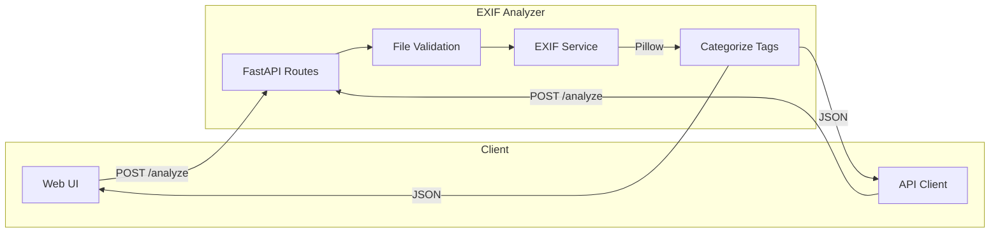

# EXIF Analyzer

Upload any photo and instantly see what's hidden inside — camera model, GPS coordinates, exposure settings, timestamps, and dozens more metadata fields, organized into readable categories.

Built as a production-ready FastAPI service with a web UI, REST API, Docker deployment, and full test suite.

<p align="center">
  <a href="https://github.com/vskrch/exif-analyzer/actions"></a>
  
  
  
  
  
</p>

---

## Table of Contents

- [Why EXIF Analyzer](#why-exif-analyzer)
- [How It Works](#how-it-works)
- [Quick Start](#quick-start)
- [API Usage](#api-usage)
- [EXIF Categories](#exif-categories)
- [Configuration](#configuration)
- [Development](#development)
- [Deployment](#deployment)
- [Tech Stack](#tech-stack)
- [License](#license)

---

## Why EXIF Analyzer

Every photo carries metadata most people never see — and some of it is sensitive (GPS location, device serial numbers, software versions). EXIF Analyzer makes that data visible and organized:

| Use case | What you get |
|----------|--------------|
| **Photography** | Aperture, shutter speed, ISO, focal length, white balance |
| **Forensics / privacy** | GPS coordinates, device make/model, software used to edit |
| **Development** | A clean REST API with typed responses and consistent error codes |
| **Operations** | Health checks, structured logs, Docker-ready deployment |

---

## How It Works



1. Upload an image via the web UI or `POST /analyze`
2. The server validates file type and size
3. Pillow extracts raw EXIF tags from the image bytes
4. Tags are formatted and grouped into categories (Camera, GPS, Date, etc.)
5. Results are returned as structured JSON

---

## Quick Start

### Prerequisites

- Python 3.10+
- pip

### Run locally

```bash
git clone https://github.com/vskrch/exif-analyzer.git
cd exif-analyzer

python -m venv .venv
source .venv/bin/activate        # Windows: .venv\Scripts\activate

pip install -r requirements.txt
cp .env.example .env

python main.py
```

Open **http://localhost:8000** — drag a photo onto the page to analyze it.

### Run with Docker

```bash
docker compose up -d              # production
docker compose --profile dev up dev   # development with hot reload
```

---

## API Usage

### Endpoints

| Method | Path | Description |
|--------|------|-------------|
| `GET` | `/` | Web UI |
| `POST` | `/analyze` | Upload image, get categorized EXIF |
| `GET` | `/health` | Service status, version, environment |
| `GET` | `/docs` | Interactive OpenAPI docs (debug mode) |

### Example: analyze with curl

```bash
curl -X POST http://localhost:8000/analyze \
  -F "file=@photo.jpg" \
  | jq .
```

### Success response

```json
{
  "filename": "photo.jpg",
  "content_type": "image/jpeg",
  "total_tags": 24,
  "categorized": {
    "Camera & Device": [
      { "tag": "Make", "value": "Canon" },
      { "tag": "Model", "value": "EOS R5" }
    ],
    "Date & Time": [
      { "tag": "DateTimeOriginal", "value": "2024:01:15 10:30:00" }
    ],
    "Camera Settings": [
      { "tag": "ExposureTime", "value": "1/250" },
      { "tag": "FNumber", "value": "2.8" },
      { "tag": "ISOSpeedRatings", "value": "400" }
    ],
    "GPS & Location": [
      { "tag": "GPSLatitude", "value": "37.7749" },
      { "tag": "GPSLongitude", "value": "-122.4194" }
    ]
  }
}
```

### Error response

All errors follow the same shape:

```json
{
  "error": {
    "code": "FILE_TOO_LARGE",
    "message": "File too large. Maximum size is 25MB."
  }
}
```

| Code | HTTP | When |
|------|------|------|
| `EMPTY_FILE` | 400 | Zero-byte upload |
| `INVALID_FILE_TYPE` | 415 | File extension not in allowlist |
| `INVALID_IMAGE_CONTENT` | 415 | Magic bytes do not match extension |
| `FILE_TOO_LARGE` | 413 | File exceeds `MAX_UPLOAD_SIZE_MB` |
| `NO_EXIF_DATA` | 422 | Image contains no EXIF metadata |
| `EXIF_PROCESSING_ERROR` | 422 | Image bytes could not be parsed |
| `RATE_LIMIT_EXCEEDED` | 429 | Too many requests |

---

## EXIF Categories

Extracted tags are automatically grouped:

| Category | Example tags |
|----------|-------------|
| **Camera & Device** | Make, Model, Software, LensModel |
| **Date & Time** | DateTimeOriginal, DateTimeDigitized |
| **Image Dimensions** | ImageWidth, ImageLength, Resolution |
| **Camera Settings** | ExposureTime, FNumber, ISO, FocalLength, Flash |
| **GPS & Location** | GPSLatitude, GPSLongitude, GPSAltitude |
| **Other** | Any remaining tags |

### Supported formats

| Format | EXIF support |
|--------|--------------|
| JPEG / JPG | Full |
| TIFF | Full |
| PNG, WebP | Limited |
| BMP, GIF | None |

Magic-byte validation rejects extension spoofing (e.g. renaming a text file to `.jpg`).

---

## Configuration

Copy `.env.example` to `.env`. All settings load via environment variables.

| Variable | Default | Description |
|----------|---------|-------------|
| `APP_ENV` | `development` | `development`, `production`, `testing` |
| `APP_DEBUG` | `false` | Enables `/docs` and hot reload |
| `HOST` | `0.0.0.0` | Bind address |
| `PORT` | `8000` | Server port |
| `MAX_UPLOAD_SIZE_MB` | `25` | Max upload size |
| `MAX_IMAGE_PIXELS` | `25000000` | Decompression-bomb protection |
| `ALLOWED_EXTENSIONS` | `.jpg,.jpeg,.png,...` | Permitted file types |
| `RATE_LIMIT_PER_MINUTE` | `30` | General API rate limit |
| `RATE_LIMIT_UPLOAD_PER_MINUTE` | `10` | `/analyze` rate limit |
| `TRUSTED_HOSTS` | `localhost,127.0.0.1` | Allowed Host headers (production) |
| `SECRET_KEY` | (required in prod) | Must be set when `APP_ENV=production` |
| `LOG_LEVEL` | `INFO` | `DEBUG`, `INFO`, `WARNING`, `ERROR` |
| `CORS_ORIGINS` | `http://localhost:8000` | Allowed CORS origins |

---

## Development

### Project layout

```
exif-analyzer/
├── main.py                  # App factory (create_app)
├── app/
│   ├── config.py            # pydantic-settings
│   ├── logging_config.py    # Structured logging + request IDs
│   ├── core/
│   │   ├── exceptions.py    # Typed errors + global handlers
│   │   └── security.py      # CORS, upload validation
│   ├── api/routes.py        # HTTP endpoints
│   ├── services/exif_service.py
│   └── schemas/exif.py      # Pydantic models
├── templates/ + static/     # Web UI
├── tests/                   # 33 tests, 86% coverage
├── Dockerfile               # Multi-stage, non-root
└── .github/workflows/ci.yml # Lint, test, Docker build
```

### Commands

```bash
pip install -r requirements-dev.txt

pytest                                    # run tests
pytest --cov=app --cov-report=term-missing  # with coverage
ruff check . && ruff format --check .     # lint + format
```

---

## Deployment

### Docker Compose (recommended)

```bash
docker compose up -d
```

The container runs as a non-root user with a built-in health check on `/health`.

### Gunicorn + Uvicorn workers

```bash
gunicorn main:app -w 4 -k uvicorn.workers.UvicornWorker -b 0.0.0.0:8000
```

### Production environment

```bash
APP_ENV=production
APP_DEBUG=false
LOG_LEVEL=WARNING
SECRET_KEY=<generate-a-long-random-string>
CORS_ORIGINS=https://yourdomain.com
```

---

## Tech Stack

| Layer | Technology |
|-------|-----------|
| Framework | [FastAPI](https://fastapi.tiangolo.com/) |
| Image processing | [Pillow](https://pillow.readthedocs.io/) |
| Validation | [Pydantic v2](https://docs.pydantic.dev/) + pydantic-settings |
| Server | [Uvicorn](https://www.uvicorn.org/) |
| Templates | Jinja2 |
| Testing | pytest + httpx (86% coverage) |
| Linting | ruff |
| CI/CD | GitHub Actions |
| Containers | Docker (multi-stage build) |

---

## License

[MIT](LICENSE)
